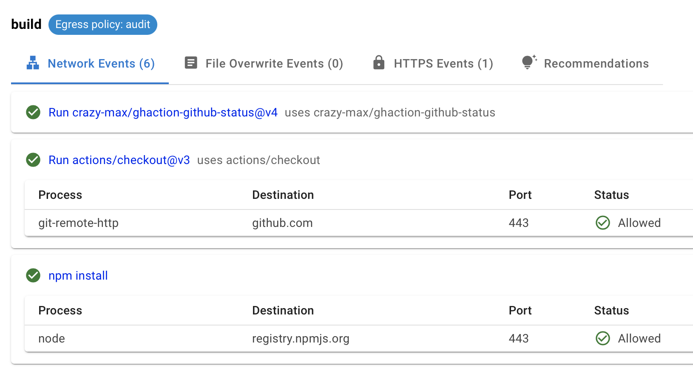
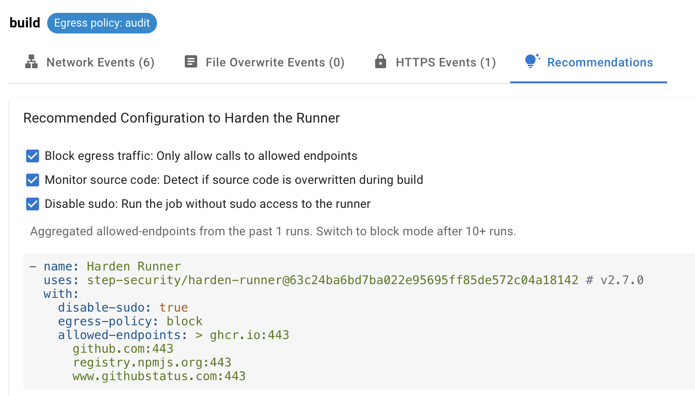
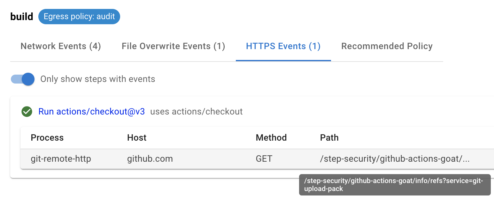
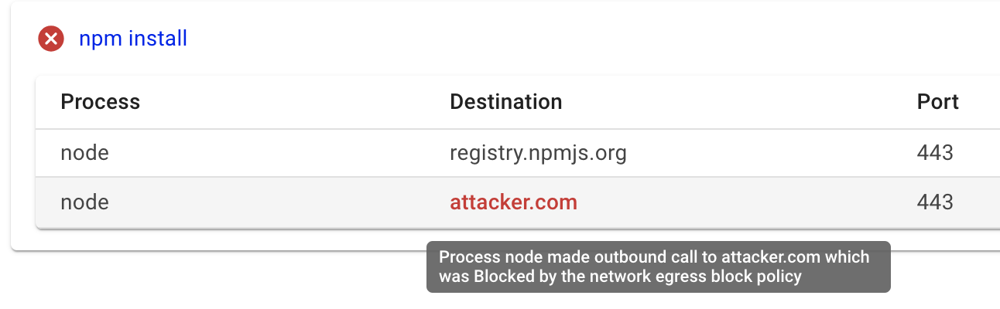
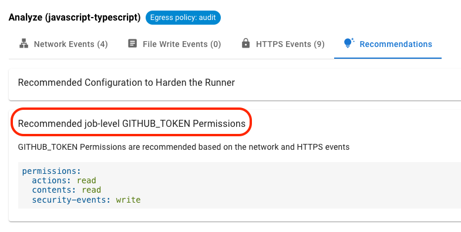
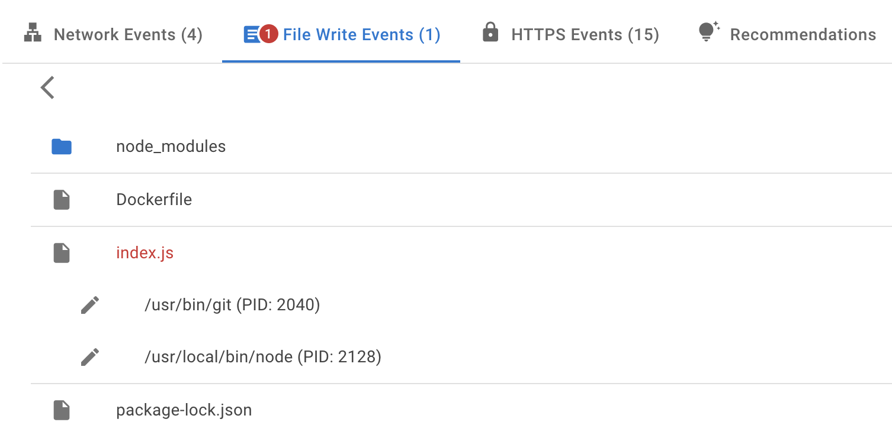
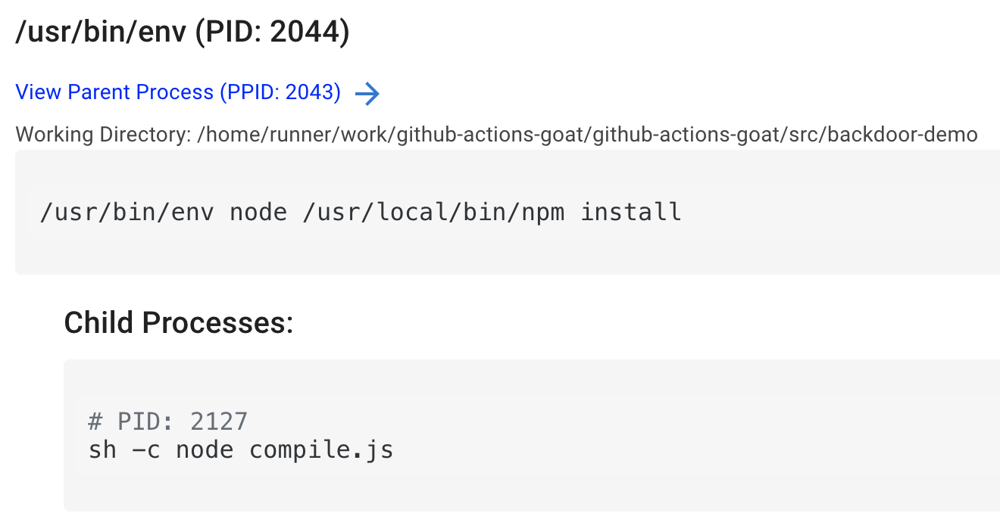
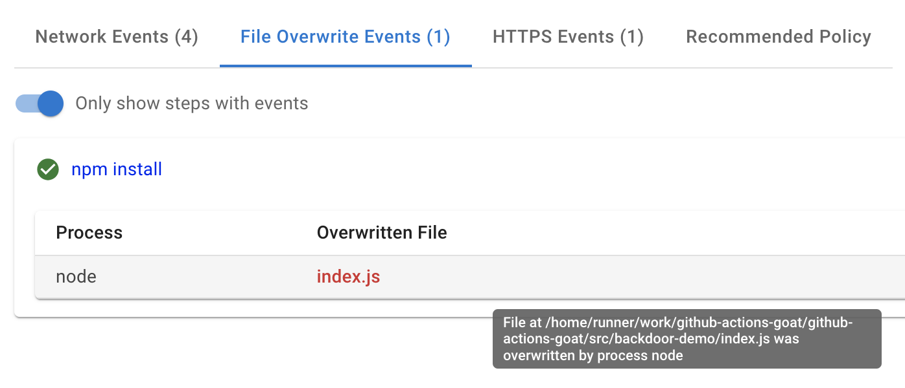

<p align="center">
<picture>
  <source media="(prefers-color-scheme: light)" srcset="images/banner.png" width="400">
  
</picture>
</p>

<div align="center">

[](https://stepsecurity.io/?utm_source=github&utm_medium=organic_oss&utm_campaign=harden-runner)
[](https://api.securityscorecards.dev/projects/github.com/step-security/harden-runner)
[](https://raw.githubusercontent.com/step-security/harden-runner/main/LICENSE)

</div>

## Table of Contents

- [Harden GitHub-hosted and self-hosted runners](#harden-github-hosted-and-self-hosted-runners)
- [3,500+ open source projects use Harden-Runner](#3500-open-source-projects-use-harden-runner)
  - [Trusted By](#trusted-by)
  - [Case Studies](#case-studies)
- [Why use Harden-Runner](#why-use-harden-runner)
- [Getting Started](#getting-started)
  - [GitHub-Hosted Runners](#github-hosted-runners)
    - [Hands-On Tutorials](#hands-on-tutorials)
  - [Support for Self-Hosted Runners and Private Repositories](#support-for-self-hosted-runners-and-private-repositories)
    - [Self-Hosted Actions Runner Controller (ARC) Runners](#self-hosted-actions-runner-controller-arc-runners)
    - [Self-Hosted VM Runners (e.g. on EC2)](#self-hosted-vm-runners-eg-on-ec2)
- [Features at a glance](#features-at-a-glance)
  - [View outbound network traffic](#view-outbound-network-traffic)
  - [View outbound HTTPS traffic](#view-outbound-https-traffic)
  - [Detect anomalous outbound network traffic](#️detect-anomalous-outbound-network-traffic)
  - [Filter outbound network traffic to allowed endpoints](#filter-outbound-network-traffic-to-allowed-endpoints)
  - [View recommendation for minimum GITHUB_TOKEN permissions](#view-recommendation-for-minimum-github_token-permissions)
  - [View the name and path of every file written during the build process](#view-the-name-and-path-of-every-file-written-during-the-build-process)
  - [View process names and arguments](#view-process-names-and-arguments)
  - [Detect tampering of source code during build](#detect-tampering-of-source-code-during-build)
  - [Run your job without sudo access](#run-your-job-without-sudo-access)
  - [Get security alerts](#get-security-alerts)
- [Discussions](#discussions)
- [How does it work?](#how-does-it-work)
  - [GitHub-Hosted Runners](#github-hosted-runners-1)
  - [Self-Hosted Actions Runner Controller (ARC) Runners](#self-hosted-actions-runner-controller-arc-runners-1)
  - [Self-Hosted VM Runners (e.g. on EC2)](#self-hosted-vm-runners-eg-on-ec2-1)
- [Limitations](#limitations)
  - [GitHub-Hosted Runners](#github-hosted-runners-2)
  - [Self-Hosted Actions Runner Controller (ARC) Runners](#self-hosted-actions-runner-controller-arc-runners-2)
  - [Self-Hosted VM Runners (e.g. on EC2)](#self-hosted-vm-runners-eg-on-ec2-2)


## Harden GitHub-hosted and self-hosted runners

Harden-Runner provides network egress filtering and runtime security for GitHub-hosted and self-hosted runners.

Learn how Harden-Runner works through the video below, which shows how it detected a supply chain attack on a Google open-source project.

<a href="https://youtu.be/Yz72qAOrN9s" target="_blank"></a>

## 3,500+ open source projects use Harden-Runner

Harden-Runner is trusted by leading open source projects and enterprises to secure their CI/CD pipelines.

### Trusted by


| [](https://app.stepsecurity.io/github/cisagov/skeleton-generic/actions/runs/7588528684) | [](https://app.stepsecurity.io/github/microsoft/ebpf-for-windows/actions/runs/7587031851) | [](https://app.stepsecurity.io/github/GoogleCloudPlatform/functions-framework-ruby/actions/runs/7576989995) | [](https://app.stepsecurity.io/github/DataDog/stratus-red-team/actions/runs/7446169664) | [](https://app.stepsecurity.io/github/intel/cve-bin-tool/actions/runs/7590975903) | [](https://app.stepsecurity.io/github/kubernetes-sigs/cluster-api-provider-azure/actions/runs/7591172950) | [](https://app.stepsecurity.io/github/nodejs/node/actions/runs/7591405720) | [](https://app.stepsecurity.io/github/aws/aperf/actions/runs/7631366761) |
| --------------------------------------------------------------------------------------------------------------------------------------------------------- | --------------------------------------------------------------------------------------------------------------------------------------------------------------- | ------------------------------------------------------------------------------------------------------------------------------------------------------------------------------ | ---------------------------------------------------------------------------------------------------------------------------------------------------------- | ---------------------------------------------------------------------------------------------------------------------------------------------------- | --------------------------------------------------------------------------------------------------------------------------------------------------------------------------------- | ---------------------------------------------------------------------------------------------------------------------------------------------- | ---------------------------------------------------------------------------------------------------------------------------------------- |
| **CISA**<br>[Explore](https://app.stepsecurity.io/github/cisagov/skeleton-generic/actions/runs/7588528684)                                                | **Microsoft**<br>[Explore](https://app.stepsecurity.io/github/microsoft/ebpf-for-windows/actions/runs/7587031851)                                               | **Google**<br>[Explore](https://app.stepsecurity.io/github/GoogleCloudPlatform/functions-framework-ruby/actions/runs/7576989995)                                               | **DataDog**<br>[Explore](https://app.stepsecurity.io/github/DataDog/stratus-red-team/actions/runs/7446169664)                                              | **Intel**<br>[Explore](https://app.stepsecurity.io/github/intel/cve-bin-tool/actions/runs/7590975903)                                                | **Kubernetes**<br>[Explore](https://app.stepsecurity.io/github/kubernetes-sigs/cluster-api-provider-azure/actions/runs/7591172950)                                                | **Node.js**<br>[Explore](https://app.stepsecurity.io/github/nodejs/node/actions/runs/7591405720)                                               | **AWS**<br>[Explore](https://app.stepsecurity.io/github/aws/aperf/actions/runs/7631366761)                                               |

### Case Studies

- [Harden-Runner Detects CI/CD Supply Chain Attack in Google’s Open-Source Project Flank](https://www.stepsecurity.io/case-studies/flank)
- [Kapiche secures their GitHub Actions software supply chain with Harden-Runner](https://www.stepsecurity.io/case-studies/kapiche)
- [Arcjet Enhances CI/CD Security with Harden-Runner](https://www.stepsecurity.io/case-studies/arcjet)


## Why use Harden-Runner

There are two main threats from compromised workflows, dependencies, and build tools in a CI/CD environment:

1. Exfiltration of CI/CD credentials and source code
2. Tampering of source code, dependencies, or artifacts during the build to inject a backdoor

Harden-Runner monitors process, file, and network activity to:

|     | Countermeasure                                                                                                                                                    | Prevent Security Breach                                                                                                                                                                                                                                                                                                                                       |
| --- | ----------------------------------------------------------------------------------------------------------------------------------------------------------------- | ------------------------------------------------------------------------------------------------------------------------------------------------------------------------------------------------------------------------------------------------------------------------------------------------------------------------------------------------------------- |
| 1.  | Monitor and block outbound network traffic at the DNS, HTTPS (Layer 7), and network layers (Layers 3 and 4) to prevent exfiltration of code and CI/CD credentials | To prevent the [Codecov breach](https://github.com/step-security/github-actions-goat/blob/main/docs/Vulnerabilities/ExfiltratingCICDSecrets.md) scenario                                                                                                                                                                                                      |
| 2.  | Detect if source code is being tampered during the build process to inject a backdoor                                                                             | To detect the [XZ Utils](https://www.stepsecurity.io/blog/analysis-of-backdoored-xz-utils-build-process-with-harden-runner) and [SolarWinds incident](https://github.com/step-security/github-actions-goat/blob/main/docs/Vulnerabilities/TamperingDuringBuild.md) scenarios                                                                                  |
| 3.  | Detect poisoned workflows and compromised dependencies that exhibit suspicious behavior                                                                           | To detect [Dependency confusion](https://github.com/step-security/github-actions-goat/blob/main/docs/Vulnerabilities/ExfiltratingCICDSecrets.md#dependency-confusion-attacks) and [Malicious dependencies](https://github.com/step-security/github-actions-goat/blob/main/docs/Vulnerabilities/ExfiltratingCICDSecrets.md#compromised-dependencies) scenarios |
| 4.  | Determine minimum GITHUB_TOKEN permissions by monitoring HTTPS calls to GitHub APIs                                                                               | To set [minimum GITHUB_TOKEN permissions]() to reduce the impact of exfiltration                                                                                                                                                                                                                                                                                  |

## Getting Started

### GitHub-Hosted Runners

1. Add the `step-security/harden-runner` GitHub Action to your GitHub Actions workflow file as the first step in each job. You can automate this step by pasting your workflow in the [StepSecurity online tool](https://app.stepsecurity.io/secureworkflow).

   ```yaml
   steps:
     - uses: step-security/harden-runner@17d0e2bd7d51742c71671bd19fa12bdc9d40a3d6 # v2.8.1
       with:
         egress-policy: audit
   ```

2. In the workflow logs and the job markdown summary, you will see a link to security insights and recommendations.

    <p align="left">
      
    </p>

3. Click on the link ([example link](https://app.stepsecurity.io/github/step-security/github-actions-goat/actions/runs/7704454287)). You will see a process monitor view of network and file events correlated with each step of the job.

    <p align="left">
      
    </p>

4. In the `Recommended Policy` tab, you'll find a recommended block policy based on outbound calls aggregated from the current and past runs of the job. You can update your workflow file with this policy, or alternatively, use the [Policy Store](https://docs.stepsecurity.io/harden-runner/how-tos/block-egress-traffic#2-add-the-policy-using-the-policy-store) to apply the policy without modifying the workflow file. From now on, any outbound calls not in the allowed list will be blocked.

    <p align="left">
      
    </p>

#### Hands-On Tutorials

You can use [GitHub Actions Goat](https://github.com/step-security/github-actions-goat) to try Harden-Runner. You only need a GitHub Account and a web browser.

Hands-on Tutorials for GitHub Actions Runtime Security:

1. [Filter Egress Network Traffic](https://github.com/step-security/github-actions-goat/blob/main/docs/Solutions/RestrictOutboundTraffic.md)
2. [Detect File Tampering](https://github.com/step-security/github-actions-goat/blob/main/docs/Solutions/MonitorSourceCode.md)

### Support for Self-Hosted Runners and Private Repositories

Hardening for self-hosted runners and GitHub-hosted runners used in private repositories is supported with a commercial license. Check out the [documentation](https://docs.stepsecurity.io/stepsecurity-platform/billing) for more details.

- To use Harden-Runner in a `Private` repository, you must install the [StepSecurity Actions Security GitHub App](https://github.com/apps/stepsecurity-actions-security).
- This is needed to access the GitHub Actions API and to authenticate users to access the insights URL for private repositories.
- If you use Harden-Runner GitHub Action in a private repository, the generated insights URL is NOT public. Only those who have access to the repository can view it.

Read this [case study on how Kapiche uses Harden-Runner](https://www.stepsecurity.io/case-studies/kapiche/) to improve software supply chain security in their private repositories.

#### Self-Hosted Actions Runner Controller (ARC) Runners

> Explore demo workflows using self-hosted ARC Runner and ARC Harden-Runner [here](https://docs.stepsecurity.io/harden-runner/how-tos/enable-runtime-security-arc).

Actions Runner Controller (ARC) is a Kubernetes operator that orchestrates self-hosted runners for GitHub Actions.

- Instead of adding the Harden-Runner GitHub Action in each job, you'll need to install the ARC Harden-Runner daemonset on your Kubernetes cluster.
- Upon installation, the ARC Harden-Runner daemonset monitors all jobs run on the cluster; you do NOT need to add the Harden-Runner GitHub Action to each job for `audit` mode. You do need to add the Harden-Runner GitHub Action to jobs where you want to enable `block` mode.
- The instructions for installing the ARC-Harden-Runner daemonset are shown in the dashboard. To enable access to these instructions, please email support@stepsecurity.io.

#### Self-Hosted VM Runners (e.g. on EC2)

> Explore demo workflows using self-hosted VM Runners and Harden-Runner [here](https://docs.stepsecurity.io/harden-runner/how-tos/enable-runtime-security-vm).

- Instead of adding the Harden-Runner GitHub Action in each job, you'll need to install the Harden-Runner agent on your runner image (e.g. AMI). This is typically done using packer or as a post-install step when using the https://github.com/philips-labs/terraform-aws-github-runner project to setup runners.
- The Harden-Runner agent monitors all jobs run on the VM, both ephemeral and persistent runners are supported; you do NOT need to add the Harden-Runner GitHub Action to each job for `audit` mode. You do need to add the Harden-Runner GitHub Action to jobs where you want to enable `block` mode.
- The instructions for installing the Harden-Runner agent on your self-hosted VM runners are shown in the dashboard. To enable access to these instructions, please email support@stepsecurity.io. This agent is different than the one used for GitHub-hosted runners.

## Features at a glance

For details, check out the documentation at https://docs.stepsecurity.io

### View outbound network traffic

> Applies to both GitHub-hosted and self-hosted runners

Harden-Runner monitors all outbound traffic from each job at the DNS and network layers

- After the workflow completes, each outbound call is correlated with each step of the job, and shown in the insights page
- For self-hosted runners, no changes are needed to workflow files to monitor egress traffic
- A filtering (block) egress policy is suggested in the insights page based on the current and past job runs

### View outbound HTTPS traffic

> Applies to GitHub-hosted and self-hosted VM runners

Harden-Runner can monitor outbound HTTPS requests. This feature is supported with a commercial license.

- HTTPS events are monitored using eBPF (no MITM proxy is used)
- If a HTTP PUT/ POST/ PATCH call is made to GitHub APIs to a HTTP Path with a different organization than where the workflow is running, the call is marked as anomalous
- As of now, only HTTPS calls to `github.com`, `api.github.com`, `*.pkg.github.com`, and `ghcr.io` hosts are monitoried.

<p align="left">
  
</p>

### Detect anomalous outbound network traffic

> Applies to both GitHub-hosted and self-hosted runners

Harden-Runner creates a baseline of outbound traffic for each job during the first few runs that it monitors

- After the baseline is created, any new outbound destinations are marked as anomalous in the insights page
- You can view the list of all anomalous outbound network traffic in the `Runtime detections` page on the dashboard

### Filter outbound network traffic to allowed endpoints

> Applies to both GitHub-hosted and self-hosted runners

Once allowed endpoints are set in the policy in the workflow file, or in the [Policy Store](https://docs.stepsecurity.io/harden-runner/how-tos/block-egress-traffic#2-add-the-policy-using-the-policy-store)

- Harden-Runner blocks egress traffic at the DNS (Layer 7) and network layers (Layers 3 and 4)
- It blocks DNS exfiltration, where attacker tries to send data out using DNS resolution
- Wildcard domains are supported, e.g. you can add `*.data.mcr.microsoft.com:443` to the allowed list, and egress traffic will be allowed to `eastus.data.mcr.microsoft.com:443` and `westus.data.mcr.microsoft.com:443`

<p align="left">
  
</p>

### View recommendation for minimum GITHUB_TOKEN permissions

> Applies to GitHub-hosted runners

Harden-Runner monitors outbound HTTPS requests using eBPF and uses the PATHs and VERBs of these HTTPS calls to recommend the minimum GITHUB_TOKEN permissions for each job in your workflow. This feature is supported with a commercial license.

- GITHUB_TOKEN is an automatically generated secret used to authenticate to GitHub APIs from GitHub Actions workflows.
- Harden-Runner can monitor the VERBs (e.g., `GET`, `POST`) and PATHs (e.g., `/repos/owner/repo/issues`) for calls made to the GitHub APIs from the runner.
- Each GitHub Actions API call requires a corresponding GITHUB_TOKEN permission. For instance, a GET request to the `/repos/org/repo/info/refs?service=git-upload-pack` endpoint requires the `contents: read` permission.
- The recommendation for the minimum GITHUB_TOKEN permissions are show in the `Recommendations` tab.

<p align="left">
  
</p>

### View the name and path of every file written during the build process

> Applies to both GitHub-hosted and self-hosted runners

View the name and path of every file that was written during the build process. This feature is supported with a commercial license.

- Harden-Runner tracks every file written to the GitHub Actions working directory during the build process.
- In the insights page in the `File Write Events` tab you can see a file explorer view of each file that was written to.
- Clicking on any file reveals a list of processes that wrote to it, providing complete transparency.

<p align="left">
  
</p>

### View process names and arguments

> Applies to both GitHub-hosted and self-hosted runners

View process names, PIDs, and process arguments. This feature is supported with a commercial license.

- Harden-Runner tracks every process that is run during the build process.
- Clicking on any process ID (PID) in the network events, file events, or HTTPS events shows the process that caused the event, along with the process arguments.
- You can walk up the process tree by clicking `View Parent Process` to understand the build process and detect suspicious activity.

<p align="left">
  
</p>

### Detect tampering of source code during build

> Applies to both GitHub-hosted and self-hosted runners

Harden-Runner monitors file writes and can detect if a file is overwritten.

- Source code overwrite is not expected in a release build
- All source code files are monitored, which means even changes to IaC files (Kubernetes manifest, Terraform) are detected
- You can enable notifications to get one-time alert when source code is overwritten
- For self-hosted runners, no changes are needed to workflow files for file monitoring

<p align="left">
  
</p>

### Run your job without sudo access

> Applies to GitHub-hosted runners

GitHub-hosted runner uses passwordless sudo for running jobs.

- This means compromised build tools or dependencies can install attack tools
- If your job does not need sudo access, you see a policy
  recommendation to disable sudo in the insights page
- When you set `disable-sudo` to `true`, the job steps run without sudo access to the GitHub-hosted Ubuntu VM

### Get security alerts

> Applies to both GitHub-hosted and self-hosted runners

Install the [StepSecurity Actions Security GitHub App](https://github.com/apps/stepsecurity-actions-security) to get security alerts.

- Email and Slack notifications are supported
- Notifications are sent when outbound traffic is blocked or source code is overwritten
- Notifications are not repeated for the same alert for a given workflow

## Discussions

- If you have questions or ideas, please use [discussions](https://github.com/step-security/harden-runner/discussions).
- For support for self-hosted runners and private repositories, email support@stepsecurity.io.
- If you use a different CI/CD Provider (e.g. Jenkins, Gitlab CI, etc), and would like to use Harden Runner in your environment, please email interest@stepsecurity.io

## How does it work?

### GitHub-Hosted Runners

For GitHub-hosted runners, Harden-Runner GitHub Action downloads and installs the StepSecurity Agent.

- The code to monitor file, process, and network activity is in the Agent.
- The agent is written in Go and is open source at https://github.com/step-security/agent
- The agent's build is reproducible. You can view the steps to reproduce the build [here](http://app.stepsecurity.io/github/step-security/agent/releases/latest)

### Self-Hosted Actions Runner Controller (ARC) Runners

- ARC Harden Runner daemonset uses eBPF
- You can find more details in this blog post: https://www.stepsecurity.io/blog/introducing-harden-runner-for-kubernetes-based-self-hosted-actions-runners
- ARC Harden Runner is NOT open source.

### Self-Hosted VM Runners (e.g. on EC2)

- For self-hosted VMs, you add the Harden-Runner agent into your runner image (e.g. AMI).
- Agent for self-hosted VMs is NOT open source.

## Limitations

### GitHub-Hosted Runners

1. Only Ubuntu VM is supported. Windows and MacOS GitHub-hosted runners are not supported. There is a discussion about that [here](https://github.com/step-security/harden-runner/discussions/121).
2. Harden-Runner is not supported when [job is run in a container](https://docs.github.com/en/actions/using-jobs/running-jobs-in-a-container) as it needs sudo access on the Ubuntu VM to run. It can be used to monitor jobs that use containers to run steps. The limitation is if the entire job is run in a container. That is not common for GitHub Actions workflows, as most of them run directly on `ubuntu-latest`. Note: This is not a limitation for Self-Hosted runners.

### Self-Hosted Actions Runner Controller (ARC) Runners

1. Since ARC Harden Runner uses eBPF, only Linux jobs are supported. Windows and MacOS jobs are not supported.

### Self-Hosted VM Runners (e.g. on EC2)

1. Only Ubuntu VM is supported. Windows and MacOS jobs are not supported.
