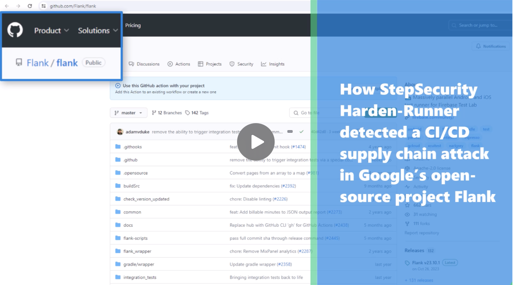
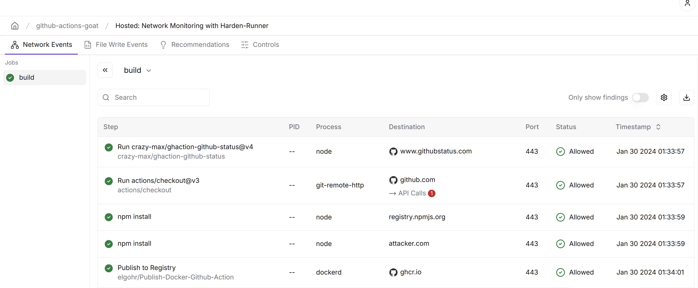

<p align="center">
<picture>
  <source media="(prefers-color-scheme: light)" srcset="images/banner.png" width="400">
  
</picture>
</p>

<div align="center">

[](https://stepsecurity.io/?utm_source=github&utm_medium=organic_oss&utm_campaign=harden-runner)
[](https://api.securityscorecards.dev/projects/github.com/step-security/harden-runner)
[](https://raw.githubusercontent.com/step-security/harden-runner/main/LICENSE)

</div>

# Harden-Runner

Corporate laptops and production servers typically have robust security monitoring in place to reduce risk and meet compliance requirements. However, CI/CD runners, which handle sensitive information like secrets for cloud environments and create production builds, often lack such security measures. This oversight has led to significant supply chain attacks, including the SolarWinds and Codecov breaches.

Traditional security monitoring and EDR solutions are ineffective for CI/CD runners due to their ephemeral nature. These tools also lack the necessary context to correlate events with specific workflow runs in a CI/CD environment.

StepSecurity Harden-Runner addresses this gap by providing security monitoring tailored for CI/CD runners. This approach brings CI/CD runners under the same level of security scrutiny as other critical systems, addressing a significant gap in the software supply chain.

## Quick Links
- [Getting Started Guide](#getting-started)
- [Why Choose Harden-Runner](#why-choose-harden-runner)
- [Features and Capabilities](#features)
- [Case Studies and Trusted Projects](#trusted-by-and-case-studies)
- [How It Works](docs/how-it-works.md)
- [Known Limitations](docs/limitations.md)
- [Join the Discussions](#discussions)

---

## Introduction

Learn how Harden-Runner works through the video below, which shows how it detected a supply chain attack on a **Google** open-source project.

<a href="https://youtu.be/Yz72qAOrN9s" target="_blank">
  
</a>

---
## Getting Started

This guide walks you through the steps to set up and use Harden-Runner in your CI/CD workflows.

### **Step 1: Add Harden-Runner to Your Workflow**

To integrate Harden-Runner, follow these steps:

- Open your GitHub Actions workflow file (e.g., `.github/workflows/<workflow-name>.yml`).
- Add the following code as the first step in each job:
   ```yaml
   steps:
     - uses: step-security/harden-runner@446798f8213ac2e75931c1b0769676d927801858 # v2.10.3
       with:
         egress-policy: audit

**Tip**: Automate this step by pasting your workflow into the [StepSecurity online tool](https://app.stepsecurity.io/secureworkflow)
<details>
<summary>Click to view the full Getting Started Guide</summary>

### **Step 2: Access Security Insights**

Run your workflow. Once completed:
- Review the **workflow logs** and the **job markdown summary**.
- Look for a link to **security insights and recommendations**.
  <p align="left">
      
    </p>
- Click on the provided link (e.g., [example link](https://app.stepsecurity.io/github/step-security/github-actions-goat/actions/runs/7704454287?jobid=20996777560&tab=network-events)) to access the **Process Monitor View**, which displays:
   - **Network events**: Outbound network calls correlated with each step.
   - **File events**: File writes tracked during the job.
     <p align="left">
      
    </p>

</details>

---
## Why Choose Harden-Runner?

- **Prevent Exfiltration:** Prevent the exfiltration of CI/CD secrets and source code.
- **Detect Tampering:** Identify source code modifications during builds.
- **Anomaly Detection:** Spot unusual dependencies and workflow behaviors.
- **Simplify Permissions:** Determine the minimum required `GITHUB_TOKEN` permissions.


---

## Features

Harden-Runner offers a comprehensive suite of features to enhance the security of your CI/CD workflows, available in two tiers: **Community** (Free) and **Enterprise** (Paid).

### Community (Free)

- **CI/CD-Aware Event Correlation:** Each outbound network connection, file operation, and process execution is mapped to the exact step, job, and workflow where it occurs.
- **Automated Baseline Creation:** Harden-Runner builds a baseline for each job based on past outbound network connections.
- **Anomaly Detection:** Once the baseline is created, any future outbound calls not in the baseline trigger a detection.
- **Block Network Egress Traffic with Domain Allowlist:** Optionally use the automatically created baseline to control outbound network traffic by specifying allowed domains, preventing unauthorized data exfiltration.
- **Detect Modification of Source Code:** Monitor and alert on unauthorized changes to your source code during the CI/CD pipeline.

### Enterprise (Paid)

Includes all features in the **Community** tier, plus:

- **Support for Private Repositories:** Extend Harden-Runner's security capabilities to your private GitHub repositories.
- **Support for Self-Hosted Runners:** Apply security controls and monitoring to self-hosted GitHub Actions runners.
- **GitHub Checks Integration:** Enable GitHub Checks for Harden-Runner—if the baseline remains unchanged, the check passes; if it changes, the check fails, showing new outbound connections.
- **View Outbound GitHub API calls at the Job Level:** Monitor HTTPS requests to GitHub APIs
- **Determine Minimum GITHUB_TOKEN Permissions:** Monitor outbound HTTPS requests to GitHub APIs to recommend the least-privilege permissions needed for your workflows, enhancing security by reducing unnecessary access.
- **View the Name and Path of Every File Written During the Build Process:** Gain visibility into every file written to the build environment, including the ability to correlate file writes with processes, ensuring complete transparency.
- **View Process Names and Arguments:** Monitor every process executed during the build process, along with its arguments, and navigate the process tree to detect suspicious activities.

For a detailed comparison and more information, please visit our [Pricing Page](https://www.stepsecurity.io/pricing).

Explore the full feature set in the [Features Documentation](https://docs.stepsecurity.io/harden-runner).

---

## Trusted By and Case Studies

Harden-Runner is trusted by over 5000 leading open-source projects and enterprises, including Microsoft, Google, Kubernetes, and more.

### Trusted by


| [](https://app.stepsecurity.io/github/cisagov/skeleton-generic/actions/runs/9947319332?jobid=27479776091&tab=network-events) | [](https://app.stepsecurity.io/github/microsoft/ebpf-for-windows/actions/runs/7587031851) | [](https://app.stepsecurity.io/github/GoogleCloudPlatform/functions-framework-ruby/actions/runs/7576989995) | [](https://app.stepsecurity.io/github/DataDog/stratus-red-team/actions/runs/7446169664) | [](https://app.stepsecurity.io/github/intel/cve-bin-tool/actions/runs/7590975903) | [](https://app.stepsecurity.io/github/kubernetes-sigs/cluster-api-provider-azure/actions/runs/7591172950) | [](https://app.stepsecurity.io/github/nodejs/node/actions/runs/7591405720) | [](https://app.stepsecurity.io/github/aws/aperf/actions/runs/7631366761) |
| --------------------------------------------------------------------------------------------------------------------------------------------------------- | --------------------------------------------------------------------------------------------------------------------------------------------------------------- | ------------------------------------------------------------------------------------------------------------------------------------------------------------------------------ | ---------------------------------------------------------------------------------------------------------------------------------------------------------- | ---------------------------------------------------------------------------------------------------------------------------------------------------- | --------------------------------------------------------------------------------------------------------------------------------------------------------------------------------- | ---------------------------------------------------------------------------------------------------------------------------------------------- | ---------------------------------------------------------------------------------------------------------------------------------------- |
| **CISA**<br>[Explore](https://app.stepsecurity.io/github/cisagov/skeleton-generic/actions/runs/9947319332?jobid=27479776091&tab=network-events)                                                | **Microsoft**<br>[Explore](https://app.stepsecurity.io/github/microsoft/ebpf-for-windows/actions/runs/7587031851)                                               | **Google**<br>[Explore](https://app.stepsecurity.io/github/GoogleCloudPlatform/functions-framework-ruby/actions/runs/7576989995)                                               | **DataDog**<br>[Explore](https://app.stepsecurity.io/github/DataDog/stratus-red-team/actions/runs/7446169664)                                              | **Intel**<br>[Explore](https://app.stepsecurity.io/github/intel/cve-bin-tool/actions/runs/7590975903)                                                | **Kubernetes**<br>[Explore](https://app.stepsecurity.io/github/kubernetes-sigs/cluster-api-provider-azure/actions/runs/7591172950)                                                | **Node.js**<br>[Explore](https://app.stepsecurity.io/github/nodejs/node/actions/runs/7591405720)                                               | **AWS**<br>[Explore](https://app.stepsecurity.io/github/aws/aperf/actions/runs/7631366761)                                               |

### Case Studies

- [Harden-Runner Detects CI/CD Supply Chain Attack in Google’s Open-Source Project Flank](https://www.stepsecurity.io/case-studies/flank)
- [StepSecurity Detects CI/CD Supply Chain Attack in Microsoft’s Open-Source Project Azure Karpenter Provider in Real-Time](https://www.stepsecurity.io/case-studies/azure-karpenter-provider)
- [How Coveo Strengthened GitHub Actions Security with StepSecurity](https://www.stepsecurity.io/case-studies/coveo)
- [Hashgraph Achieves Comprehensive CI/CD Security Without Compromising Development Speed](https://www.stepsecurity.io/case-studies/hashgraph)
- [Kapiche secures their GitHub Actions software supply chain with Harden-Runner](https://www.stepsecurity.io/case-studies/kapiche)
- [Arcjet Enhances CI/CD Security with Harden-Runner](https://www.stepsecurity.io/case-studies/arcjet)

---

## How It Works

Want to know the technical details? Dive into the architecture of Harden-Runner and its integrations for GitHub-hosted and self-hosted runners in our [How Harden-Runner Works Documentation](docs/how-it-works.md).

---

## Limitations

While Harden-Runner offers powerful features, there are certain limitations based on the environment, such as OS support. See the complete list in [Known Limitations](docs/limitations.md).

---

## Discussions

Join the conversation! For questions, ideas, or feedback, visit our [Discussions Page](https://github.com/step-security/harden-runner/discussions).

For enterprise support, email support@stepsecurity.io. Interested in using Harden-Runner in other CI/CD platforms? Reach out to interest@stepsecurity.io.

---

## License

Harden-Runner is open source. See the [LICENSE](LICENSE) file for details.
