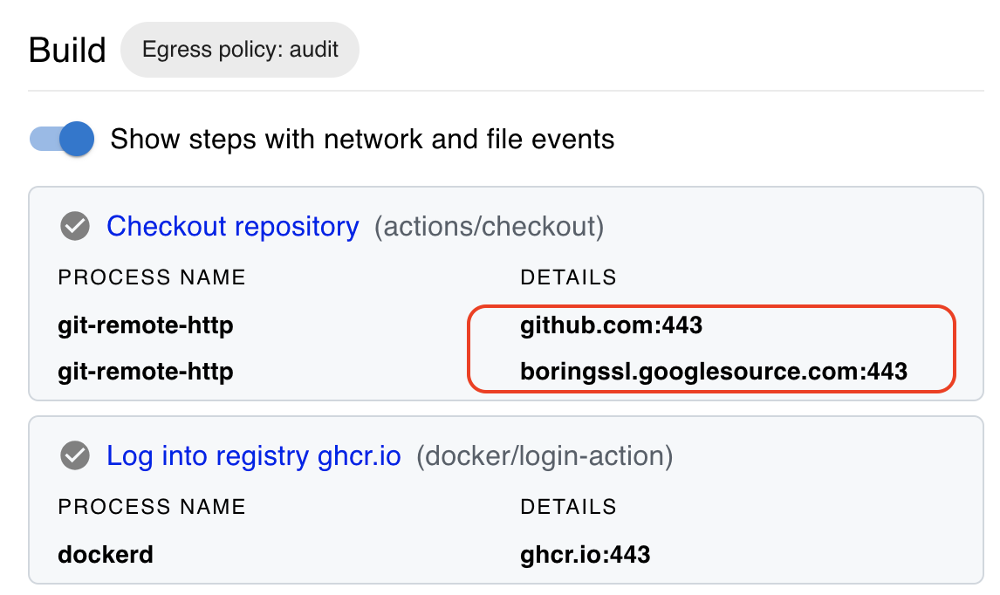
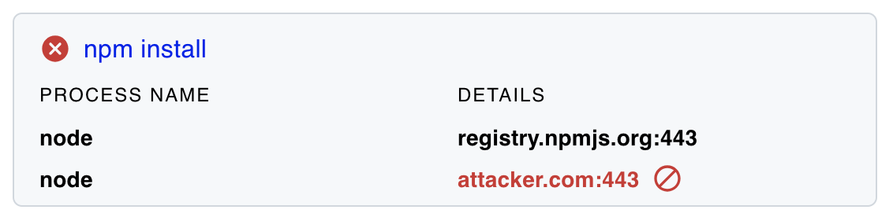
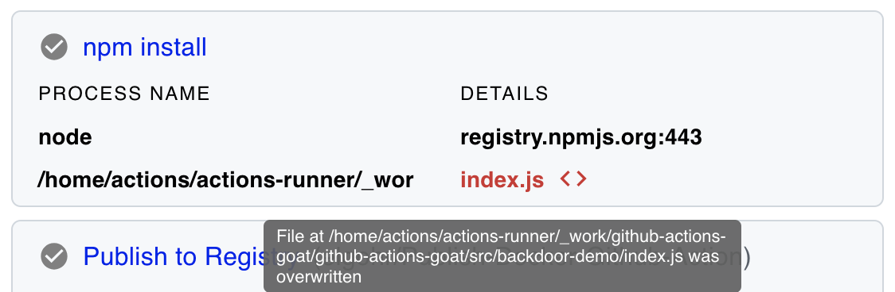

<p align="center">
<picture>
  <source media="(prefers-color-scheme: light)" srcset="images/banner.png" width="400">
  
</picture>
</p>

<div align="center">

[](https://stepsecurity.io/?utm_source=github&utm_medium=organic_oss&utm_campaign=harden-runner)
[](https://api.securityscorecards.dev/projects/github.com/step-security/harden-runner)
[](https://raw.githubusercontent.com/step-security/harden-runner/main/LICENSE)

</div>

## GitHub Actions Runtime Security

Harden-Runner provides runtime security for GitHub-hosted and self-hosted environments.

For self-hosted environments, Harden-Runner supports:

1. Kubernetes runners setup using Actions Runner Controller (ARC)
2. Virtual Machine runners (e.g. on EC2) - both ephemeral and persistent runners are supported

[](https://youtu.be/fpdwX5hYACo)

## Explore open source projects using Harden-Runner

| [](https://app.stepsecurity.io/github/cisagov/skeleton-generic/actions/runs/6199340224) | [](https://app.stepsecurity.io/github/microsoft/ebpf-for-windows/actions/runs/5559160177) | [](https://app.stepsecurity.io/github/GoogleCloudPlatform/functions-framework-ruby/actions/runs/5546354505) | [](https://app.stepsecurity.io/github/DataDog/stratus-red-team/actions/runs/5387101451) | [](https://app.stepsecurity.io/github/intel/cve-bin-tool/actions/runs/5579910614) | [](https://app.stepsecurity.io/github/kubernetes-sigs/cluster-api-provider-azure/actions/runs/5581511101) | [](https://app.stepsecurity.io/github/nodejs/node/actions/runs/5563468674) | [](https://app.stepsecurity.io/github/Mastercard/flow/actions/runs/5542112873) |
| --------------------------------------------------------------------------------------------------------------------------------------------------------- | --------------------------------------------------------------------------------------------------------------------------------------------------------------- | ------------------------------------------------------------------------------------------------------------------------------------------------------------------------------ | ---------------------------------------------------------------------------------------------------------------------------------------------------------- | ---------------------------------------------------------------------------------------------------------------------------------------------------- | --------------------------------------------------------------------------------------------------------------------------------------------------------------------------------- | ---------------------------------------------------------------------------------------------------------------------------------------------- | ----------------------------------------------------------------------------------------------------------------------------------------------------- |
| **CISA**<br>[Explore](https://app.stepsecurity.io/github/cisagov/skeleton-generic/actions/runs/6199340224)                                                | **Microsoft**<br>[Explore](https://app.stepsecurity.io/github/microsoft/ebpf-for-windows/actions/runs/5559160177)                                               | **Google**<br>[Explore](https://app.stepsecurity.io/github/GoogleCloudPlatform/functions-framework-ruby/actions/runs/5546354505)                                               | **DataDog**<br>[Explore](https://app.stepsecurity.io/github/DataDog/stratus-red-team/actions/runs/5387101451)                                              | **Intel**<br>[Explore](https://app.stepsecurity.io/github/intel/cve-bin-tool/actions/runs/5579910614)                                                | **Kubernetes**<br>[Explore](https://app.stepsecurity.io/github/kubernetes-sigs/cluster-api-provider-azure/actions/runs/5581511101)                                                | **Node.js**<br>[Explore](https://app.stepsecurity.io/github/nodejs/node/actions/runs/5563468674)                                               | **Mastercard**<br>[Explore](https://app.stepsecurity.io/github/Mastercard/flow/actions/runs/5542112873)                                               |

## Hands-On Tutorials

You can use [GitHub Actions Goat](https://github.com/step-security/github-actions-goat) to try Harden-Runner. You only need a GitHub Account and a web browser.

Hands-on Tutorials for GitHub Actions Runtime Security:

1. [Filter Egress Network Traffic](https://github.com/step-security/github-actions-goat/blob/main/docs/Solutions/RestrictOutboundTraffic.md)
2. [Detect File Tampering](https://github.com/step-security/github-actions-goat/blob/main/docs/Solutions/MonitorSourceCode.md)

## Why

Compromised workflows, dependencies, and build tools typically make outbound calls to exfiltrate credentials, or may tamper source code, dependencies, or artifacts during the build.

Harden-Runner monitors process, file, and network activity to:

|     | Countermeasure                                                                                                                      | Prevent Security Breach                                                                                                                                                                                                                                                                                                                             |
| --- | ----------------------------------------------------------------------------------------------------------------------------------- | --------------------------------------------------------------------------------------------------------------------------------------------------------------------------------------------------------------------------------------------------------------------------------------------------------------------------------------------------- |
| 1.  | Block egress traffic at the DNS (Layer 7) and network layers (Layers 3 and 4) to prevent exfiltration of code and CI/CD credentials | To prevent [Codecov breach](https://github.com/step-security/github-actions-goat/blob/main/docs/Vulnerabilities/ExfiltratingCICDSecrets.md) scenario                                                                                                                                                                                                |
| 2.  | Detect if source code is being tampered during the build process to inject a backdoor                                               | To detect [SolarWinds incident](https://github.com/step-security/github-actions-goat/blob/main/docs/Vulnerabilities/TamperingDuringBuild.md) scenario                                                                                                                                                                                               |
| 3.  | Detect poisoned workflows and compromised dependencies                                                                              | To detect [Dependency confusion](https://github.com/step-security/github-actions-goat/blob/main/docs/Vulnerabilities/ExfiltratingCICDSecrets.md#dependency-confusion-attacks) and [Malicious dependencies](https://github.com/step-security/github-actions-goat/blob/main/docs/Vulnerabilities/ExfiltratingCICDSecrets.md#compromised-dependencies) |

Read this [case study](https://infosecwriteups.com/detecting-malware-packages-in-github-actions-7b93a9985635) on how Harden-Runner detected malicious packages in the NPM registry.

## How

### GitHub-Hosted Runners

1. Add `step-security/harden-runner` GitHub Action to your GitHub Actions workflow file as the first step in each job.

   ```yaml
   steps:
     - uses: step-security/harden-runner@1b05615854632b887b69ae1be8cbefe72d3ae423 # v2.6.0
       with:
         egress-policy: audit
   ```

2. In the workflow logs and the job markdown summary, you will see a link to security insights and recommendations.

    <p align="left">
      
    </p>

3. Click on the link ([example link](https://app.stepsecurity.io/github/microsoft/msquic/actions/runs/5577342236)). You will see a process monitor view of network and file events correlated with each step of the job.

    <p align="left">
      
    </p>

4. Under the insights section, you'll find a Recommended Policy. You can either update your workflow file with this Policy, or alternatively, use the [Policy Store](https://docs.stepsecurity.io/harden-runner/how-tos/block-egress-traffic#2-add-the-policy-using-the-policy-store) to apply the policy without modifying the workflow file.

    <p align="left">
      
    </p>

### Self-Hosted Actions Runner Controller (ARC) Runners

> Explore demo workflows using self-hosted ARC Runner and ARC Harden-Runner [here](https://docs.stepsecurity.io/harden-runner/how-tos/enable-runtime-security-arc).

Actions Runner Controller (ARC) is a Kubernetes operator that orchestrates and scales self-hosted runners for GitHub Actions.

- Instead of adding the Harden-Runner GitHub Action in each workflow, you'll need to install the ARC Harden-Runner daemonset on your Kubernetes cluster.
- Upon installation, the ARC Harden-Runner daemonset constantly monitors each workflow run; you do NOT need to add the Harden-Runner GitHub Action to each job for `audit` mode. You do need to add the Harden-Runner GitHub Action for `block` mode.
- You can access security insights and runtime detections under the `Runtime Security` tab in your dashboard.

### Self-Hosted VM Runners (e.g. on EC2)

> Explore demo workflows using self-hosted VM Runners and Harden-Runner [here](https://docs.stepsecurity.io/harden-runner/how-tos/enable-runtime-security-vm).

- Instead of adding the Harden-Runner GitHub Action in each workflow, you'll need to install the Harden-Runner agent on your runner image (e.g. AMI). This is typically done using packer.
- The Harden-Runner agent monitors each job run on the VM, both ephemeral and persistent runners are supported; you do NOT need to add the Harden-Runner GitHub Action to each job for `audit` mode. You do need to add the Harden-Runner GitHub Action for `block` mode.
- You can access security insights and runtime detections under the `Runtime Security` tab in your dashboard.

## Support for Self-Hosted Runners and Private Repositories

Runtime security for self-hosted runners and private repositories are supported with a commercial license. Check out the [documentation](https://docs.stepsecurity.io/stepsecurity-platform/billing) for more details.

- Install the [StepSecurity Actions Security GitHub App](https://github.com/apps/stepsecurity-actions-security) to use Harden-Runner GitHub Action for `Private` repositories.
- If you use Harden-Runner GitHub Action in a private repository, the generated insights URL is NOT public.
- You need to authenticate first to access insights URL for private repository. Only those who have access to the repository can view it.

Read this [case study on how Kapiche uses Harden-Runner](https://www.stepsecurity.io/case-studies/kapiche/) to improve software supply chain security in their private repositories.

## Features at a glance

For details, check out the documentation at https://docs.stepsecurity.io

### 👀 Monitor egress traffic

> Applies to both GitHub-hosted and self-hosted runners

Harden-Runner monitors all outbound traffic from each job at the DNS and network layers

- After the workflow completes, each outbound call is correlated with each step of the job, and shown in the insights page
- For self-hosted runners, no changes are needed to workflow files to monitor egress traffic
- A filtering (block) egress policy is suggested in the insights page based on past job runs

### 🚦 Filter egress traffic to allowed endpoints

> Applies to both GitHub-hosted and self-hosted runners

Once allowed endpoints are set in the policy in the workflow file, or in the [Policy Store](https://docs.stepsecurity.io/harden-runner/how-tos/block-egress-traffic#2-add-the-policy-using-the-policy-store)

- Harden-Runner blocks egress traffic at the DNS (Layer 7) and network layers (Layers 3 and 4)
- It blocks DNS exfiltration, where attacker tries to send data out using DNS resolution
- Wildcard domains are supported, e.g. you can add `*.data.mcr.microsoft.com:443` to the allowed list, and egress traffic will be allowed to `eastus.data.mcr.microsoft.com:443` and `westus.data.mcr.microsoft.com:443`

<p align="left">
  
</p>

### 📁 Detect tampering of source code during build

> Applies to both GitHub-hosted and self-hosted runners

Harden-Runner monitors file writes and can detect if a file is overwritten.

- Source code overwrite is not expected in a release build
- All source code files are monitored, which means even changes to IaC files (Kubernetes manifest, Terraform) are detected
- You can enable notifications to get one-time alert when source code is overwritten
- For self-hosted runners, no changes are needed to workflow files for file monitoring

<p align="left">
  
</p>

### 🚫 Run your job without sudo access

> Applies to GitHub-hosted runners

GitHub-hosted runner uses passwordless sudo for running jobs.

- This means compromised build tools or dependencies can install attack tools
- If your job does not need sudo access, you see a policy
  recommendation to disable sudo in the insights page
- When you set `disable-sudo` to `true`, the job steps run without sudo access to the GitHub-hosted Ubuntu VM

### 🔔 Get security alerts

> Applies to both GitHub-hosted and self-hosted runners

Install the [StepSecurity Actions Security GitHub App](https://github.com/apps/stepsecurity-actions-security) to get security alerts.

- Email and Slack notifications are supported
- Notifications are sent when outbound traffic is blocked or source code is overwritten
- Notifications are not repeated for the same alert for a given workflow

## Discussions

- If you have questions or ideas, please use [discussions](https://github.com/step-security/harden-runner/discussions).
- For support for self-hosted runners and private repositories, email support@stepsecurity.io.
- If you use a different CI/CD Provider (e.g. Jenkins, Gitlab CI, etc), and would like to use Harden Runner in your environment, please email interest@stepsecurity.io

## How does it work?

### GitHub-Hosted Runners

For GitHub-hosted runners, Harden-Runner GitHub Action downloads and installs the StepSecurity Agent.

- The code to monitor file, process, and network activity is in the Agent.
- The agent is written in Go and is open source at https://github.com/step-security/agent
- The agent's build is reproducible. You can view the steps to reproduce the build [here](http://app.stepsecurity.io/github/step-security/agent/releases/latest)

### Self-Hosted Actions Runner Controller (ARC) Runners

- ARC Harden Runner daemonset uses eBPF
- You can find more details in this blog post: https://www.stepsecurity.io/blog/introducing-harden-runner-for-kubernetes-based-self-hosted-actions-runners
- ARC Harden Runner is NOT open source.

### Self-Hosted VM Runners (e.g. on EC2)

- For self-hosted VMs, you add the Harden-Runner agent into your runner image (e.g. AMI).
- Agent for self-hosted VMs is NOT open source.

## Limitations

### GitHub-Hosted Runners

1. Only Ubuntu VM is supported. Windows and MacOS GitHub-hosted runners are not supported. There is a discussion about that [here](https://github.com/step-security/harden-runner/discussions/121).
2. Harden-Runner is not supported when [job is run in a container](https://docs.github.com/en/actions/using-jobs/running-jobs-in-a-container) as it needs sudo access on the Ubuntu VM to run. It can be used to monitor jobs that use containers to run steps. The limitation is if the entire job is run in a container. That is not common for GitHub Actions workflows, as most of them run directly on `ubuntu-latest`. Note: This is not a limitation for Self-Hosted runners.

### Self-Hosted Actions Runner Controller (ARC) Runners

1. Since ARC Harden Runner uses eBPF, only Linux jobs are supported. Windows and MacOS jobs are not supported.

### Self-Hosted VM Runners (e.g. on EC2)

1. Only Ubuntu VM is supported. Windows and MacOS jobs are not supported.
