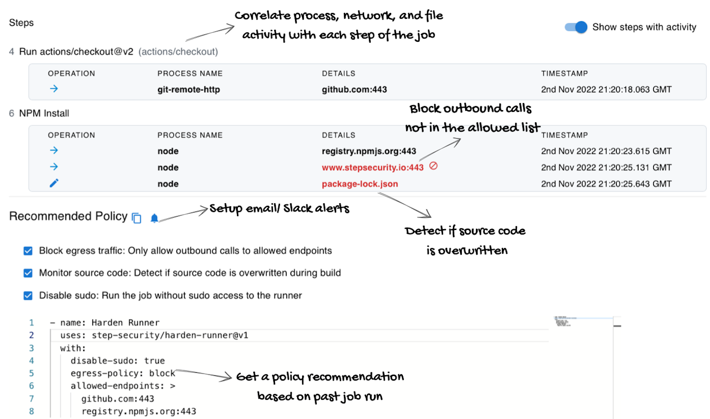
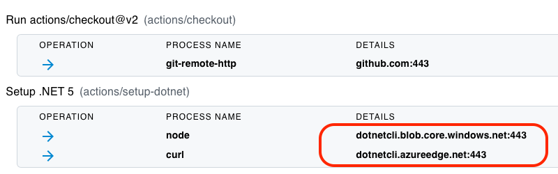
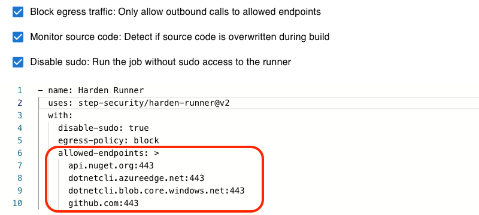
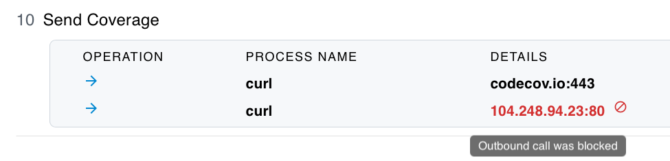
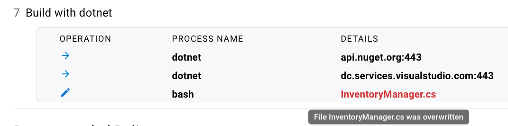

<p align="center">
<picture>
  <source media="(prefers-color-scheme: light)" srcset="images/banner.png" width="400">
  
</picture>
</p>

<div align="center">

[](https://stepsecurity.io/?utm_source=github&utm_medium=organic_oss&utm_campaign=harden-runner)
[](https://api.securityscorecards.dev/projects/github.com/step-security/harden-runner)
[](https://raw.githubusercontent.com/step-security/harden-runner/main/LICENSE)

</div>

Harden-Runner GitHub Action installs a security agent on the GitHub-hosted runner (Ubuntu VM) to

1. Prevent exfiltration of credentials
2. Detect tampering of source code during build
3. Detect compromised dependencies and build tools


<p align="left">
  
</p>

## Why

Compromised dependencies and build tools typically make outbound calls to exfiltrate credentials, or may tamper source code, dependencies, or artifacts during the build.

Harden-Runner GitHub Actions installs a daemon that monitors process, file, and network activity to:

|     | Countermeasure                                                                               | Threat                                                                                                                                                                                                                                |
| --- | -------------------------------------------------------------------------------------------- | ------------------------------------------------------------------------------------------------------------------------------------------------------------------------------------------------------------------------------------- |
| 1.  | Block outbound calls that are not in the allowed list to prevent exfiltration of credentials | To prevent [Codecov breach](https://github.com/step-security/attack-simulator/blob/main/docs/RestrictOutboundTraffic.md) scenario                                                                                                         |
| 2.  | Detect if source code is being overwritten during the build process to inject a backdoor     | To detect [SolarWinds incident scenario](https://github.com/step-security/attack-simulator/blob/main/docs/MonitorSourceCode.md)                                                                                                           |
| 3.  | Detect compromised dependencies that make unexpected outbound network calls                  | To detect [Dependency confusion](https://github.com/step-security/attack-simulator/blob/main/docs/DNSExfiltration.md) and [Malicious dependencies](https://github.com/step-security/attack-simulator/blob/main/docs/CompromisedDependency.md) |

Read this [case study](https://infosecwriteups.com/detecting-malware-packages-in-github-actions-7b93a9985635) on how Harden-Runner detected malicious packages in the NPM registry.

## How

1. Add `step-security/harden-runner` to your GitHub Actions workflow file as the first step in each job.

   ```yaml
   steps:
     - uses: step-security/harden-runner@2e205a28d0e1da00c5f53b161f4067b052c61f34
       with:
         egress-policy: audit
   ```

2. In the workflow logs, you will see a link to security insights and recommendations.

    <p align="left">
      
    </p>

3. Click on the link ([example link](https://app.stepsecurity.io/github/ossf/scorecard/actions/runs/2265028928)). You will see a process monitor view of file and network activities correlated with each step of the job.

    <p align="left">
      
    </p>

4. Below the insights, you will see the recommended policy. Update your workflow file with the recommended policy.

    <p align="left">
      
    </p>

## Features at a glance

For details, check out the documentation at https://docs.stepsecurity.io

### Restrict egress traffic to allowed endpoints

Once allowed endpoints are set in the workflow file,

- Harden-Runner blocks egress traffic at the DNS (Layer 7) and network layers (Layers 3 and 4).
- It blocks DNS exfiltration, where attacker tries to send data out using DNS resolution
- Blocks outbound traffic using IP tables

<p align="left">
  
</p>

### Detect tampering of source code during build

Harden-Runner monitors file writes and can detect if a file is overwritten.

- Source code overwrite is not expected in a release build
- All source code files are monitored, which means even changes to IaC files (Kubernetes manifest, Terraform) are detected
- You can enable notifications to get one-time alert when source code is overwritten

<p align="left">
  
</p>

### Run your job without sudo access

GitHub-hosted runner uses passwordless sudo for running jobs.

- This means compromised build tools or dependencies can install attack tools
- If your job does not need sudo access, you see a policy
  recommendation to disable sudo in the insights page
- When you set `disable-sudo` to `true`, the job steps run without sudo access to the Ubuntu VM

### Get security alerts

Install the [Harden Runner App](https://github.com/marketplace/harden-runner-app) to get security alerts.

- Email and Slack notifications are supported
- Notifications are sent when outbound traffic is blocked or source code is overwritten
- Notifications are not repeated for the same alert for a given workflow

## Support for private repositories

Private repositories are supported if they have a commercial license. Check out the [documentation](https://docs.stepsecurity.io/harden-runner/installation/business-enterprise-license) for more details.

Install the [Harden Runner App](https://github.com/marketplace/harden-runner-app) to use Harden-Runner GitHub Action for `Private` repositories.

- If you use Harden-Runner GitHub Action in a private repository, the generated insights URL is NOT public.
- You need to authenticate first to access insights URL for private repository. Only those who have access to the repository can view it.
- [Harden Runner App](https://github.com/marketplace/harden-runner-app) only needs `actions: read` permissions on your repositories.

Read this [case study on how Kapiche uses Harden Runner](https://www.stepsecurity.io/case-studies/kapiche/) to improve software supply chain security in their open source and private repositories.

## Discussions

If you have questions or ideas, please use [discussions](https://github.com/step-security/harden-runner/discussions).

1. [Support for private repositories](https://github.com/step-security/harden-runner/discussions/74)
2. [Where should allowed-endpoints be stored?](https://github.com/step-security/harden-runner/discussions/84)
3. [Cryptographically verify tools run as part of the CI/ CD pipeline](https://github.com/step-security/harden-runner/discussions/94)

## Limitations

1. Harden-Runner GitHub Action only works for GitHub-hosted runners. Self-hosted runners are not supported.
2. Only Ubuntu VM is supported. Windows and MacOS GitHub-hosted runners are not supported. There is a discussion about that [here](https://github.com/step-security/harden-runner/discussions/121).
3. Harden-Runner is not supported when [job is run in a container](https://docs.github.com/en/actions/using-jobs/running-jobs-in-a-container) as it needs sudo access on the Ubuntu VM to run. It can be used to monitor jobs that use containers to run steps. The limitation is if the entire job is run in a container. That is not common for GitHub Actions workflows, as most of them run directly on `ubuntu-latest`.

## Testimonials

> _I think this is a great idea and for the threat model of build-time, an immediate network egress request monitoring makes a lot of sense_ - [Liran Tal](https://stars.github.com/profiles/lirantal/), GitHub Star, and Author of Essential Node.js Security

> _Harden-Runner strikes an elegant balance between ease-of-use, maintainability, and mitigation that I intend to apply to all of my 300+ npm packages. I look forward to the tool’s improvement over time_ - [Jordan Harband](https://github.com/ljharb), Open Source Maintainer

> _Harden runner from Step security is such a nice solution, it is another piece of the puzzle in helping treat the CI environment like production and solving supply chain security. I look forward to seeing it evolve._ - Cam Parry, Staff Site Reliability Engineer, Kapiche

## Workflows using harden-runner

Some important workflows using harden-runner:
| |Repository |Link to insights|
|--|----------|----------------|
|1.|[nvm-sh/nvm](https://github.com/nvm-sh/nvm/blob/master/.github/workflows/lint.yml)|[Link to insights](https://app.stepsecurity.io/github/nvm-sh/nvm/actions/runs/1757959262)|
|2.|[jsx-eslint/eslint-plugin-react](https://github.com/jsx-eslint/eslint-plugin-react/blob/master/.github/workflows/release.yml)|[Link to insights](https://app.stepsecurity.io/github/yannickcr/eslint-plugin-react/actions/runs/1930818585)
|3.|[microsoft/msquic](https://github.com/microsoft/msquic/blob/main/.github/workflows/docker-publish.yml)|[Link to insights](https://app.stepsecurity.io/github/microsoft/msquic/actions/runs/1759010243)
|4.|[ossf/scorecard](https://github.com/ossf/scorecard/blob/main/.github/workflows/codeql-analysis.yml)|[Link to insights](https://app.stepsecurity.io/github/ossf/scorecard/actions/runs/2006162141)
|5.|[Automattic/vip-go-mu-plugins](https://github.com/Automattic/vip-go-mu-plugins/blob/master/.github/workflows/e2e.yml)|[Link to insights](https://app.stepsecurity.io/github/Automattic/vip-go-mu-plugins/actions/runs/1758760957)

## How does it work?

Harden-Runner GitHub Action downloads and installs the StepSecurity Agent.

- The code to monitor file, process, and network activity is in the Agent.
- The agent is written in Go and is open source at https://github.com/step-security/agent
- The agent's build is reproducible. You can view the steps to reproduce the build [here](http://app.stepsecurity.io/github/step-security/agent/releases/latest)
