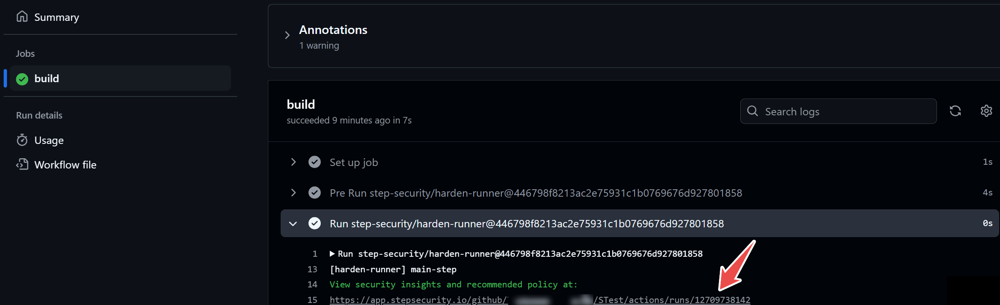
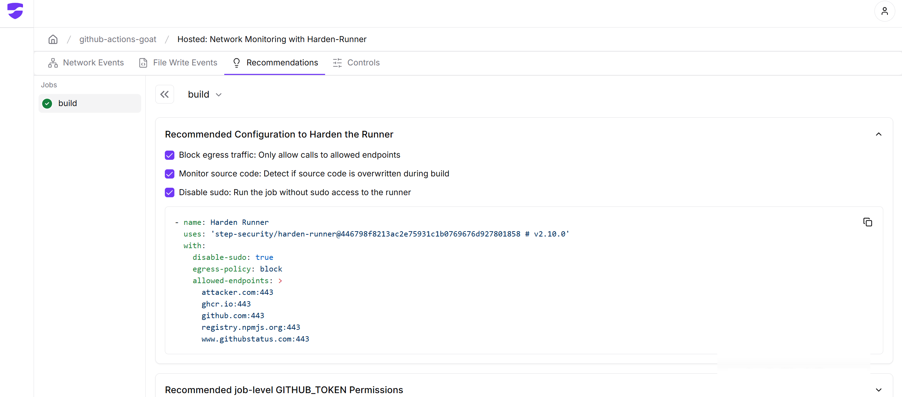

<p align="center">
<picture>
  <source media="(prefers-color-scheme: light)" srcset="images/banner.png" width="400">
  
</picture>
</p>

<div align="center">

[](https://stepsecurity.io/?utm_source=github&utm_medium=organic_oss&utm_campaign=harden-runner)
[](https://api.securityscorecards.dev/projects/github.com/step-security/harden-runner)
[](https://raw.githubusercontent.com/step-security/harden-runner/main/LICENSE)

</div>

# Harden-Runner

Harden-Runner secures CI/CD workflows by controlling network access and monitoring activities on GitHub-hosted and self-hosted runners. It blocks unauthorized network traffic and detects unusual activity to protect against potential threats. The name "Harden-Runner" comes from its purpose: strengthening the security of the runners used in GitHub Actions workflows.

## Quick Links
- [Getting Started Guide](#getting-started)
- [Why Use Harden-Runner](#why-choose-harden-runner)
- [Features and Capabilities](docs/features.md)
- [Case Studies and Trusted Projects](#trusted-by-and-case-studies)
- [How It Works](docs/how-it-works.md)
- [Known Limitations](docs/limitations.md)
- [Join the Discussions](#discussions)

---

## Introduction

Learn how Harden-Runner works through the video below, which shows how it detected a supply chain attack on a **Google** open-source project.

<a href="https://youtu.be/Yz72qAOrN9s" target="_blank">
  
</a>

Harden-Runner is trusted by leading projects across industries. For example, it has also been used to secure the **Azure Karpenter Provider**, helping Microsoft improve the security of its open-source ecosystem.[Read the full case study →](https://www.stepsecurity.io/case-studies/azure-karpenter-provider)

---
## Getting Started

This guide walks you through the steps to set up and use Harden-Runner in your CI/CD workflows.

### **Prerequisites**
Before you begin, ensure you have the following:
- GitHub account
- GitHub-hosted runner environment
- StepSecurity account


### **Step 1: Add Harden-Runner to Your Workflow**

To integrate Harden-Runner, follow these steps:

- Open your GitHub Actions workflow file (e.g., `.github/workflows/<workflow-name>.yml`).
- Add the following code as the first step in each job:
   ```yaml
   steps:
     - uses: step-security/harden-runner@446798f8213ac2e75931c1b0769676d927801858 # v2.10.0
       with:
         egress-policy: audit

**Tip**: Automate this step by pasting your workflow into the [StepSecurity online tool](https://app.stepsecurity.io/secureworkflow)

### **Step 2: Access Security Insights**

Run your workflow. Once completed:
- Review the **workflow logs** and the **job markdown summary**.
- Look for a link to **security insights and recommendations**.
  <p align="left">
      
    </p>
- Click on the provided link (e.g., [example link](https://example.com)) to access the **Process Monitor View**, which displays:
   - **Network events**: Outbound network calls correlated with each step.
   - **File events**: File writes tracked during the job.
     <p align="left">
      
    </p>

### **Step 3: Apply the Recommended Policy**

On the **Recommended Policy** tab in the insights dashboard:
- Review the suggested **block policy**, which is generated based on outbound calls from current and past runs.
- You can:
   - Add this policy directly to your workflow file, or
   - Use the [Policy Store](https://docs.stepsecurity.io/harden-runner/how-tos/block-egress-traffic#2-add-the-policy-using-the-policy-store) to apply the policy without modifying your workflow file.
    <p align="left">
      
    </p>


### **Step 4: Block Unauthorized Outbound Calls**

Once the policy is applied:
- Outbound calls not on the allowed list will be blocked.
- This ensures that only trusted endpoints are accessible, preventing potential security risks.


---
## Why Choose Harden-Runner?

- **Prevent Exfiltration:** Prevent the exfiltration of CI/CD secrets and source code.
- **Detect Tampering:** Identify source code modifications during builds.
- **Anomaly Detection:** Spot unusual dependencies and workflow behaviors.
- **Simplify Permissions:** Determine the minimum required `GITHUB_TOKEN` permissions.


---

## Features

Harden-Runner offers a comprehensive suite of features to enhance the security of your CI/CD workflows, available in two tiers: **Community** (Free) and **Enterprise** (Paid).

### Community (Free)

- **Block Network Egress Traffic with Domain Allowlist:** Control outbound network traffic by specifying allowed domains, preventing unauthorized data exfiltration.
- **Detect Compromised Packages, Dependencies & Build Tools:** Identify and mitigate risks from malicious or vulnerable components in your build process.
- **Detect Modification of Source Code:** Monitor and alert on unauthorized changes to your source code during the CI/CD pipeline.
- **Disable Sudo Access:** Restrict the use of superuser privileges in your workflows to minimize security risks.
- **Insights Page for CI/CD Runs:** Access detailed reports and analytics for each CI/CD run to monitor security events and compliance.

### Enterprise (Paid)

Includes all features in the **Community** tier, plus:

- **Support for Private Repositories:** Extend Harden-Runner's security capabilities to your private GitHub repositories.
- **Support for Self-Hosted Runners:** Apply security controls and monitoring to self-hosted GitHub Actions runners.
- **View Outbound GitHub API calls at the Job Level:** Monitor HTTPS requests to GitHub APIs
- **Determine Minimum GITHUB_TOKEN Permissions:** Monitor outbound HTTPS requests to GitHub APIs to recommend the least-privilege permissions needed for your workflows, enhancing security by reducing unnecessary access.
- **View the Name and Path of Every File Written During the Build Process:** Gain visibility into every file written to the build environment, including the ability to correlate file writes with processes, ensuring complete transparency.
- **View Process Names and Arguments:** Monitor every process executed during the build process, along with its arguments, and navigate the process tree to detect suspicious activities.


For a detailed comparison and more information, please visit our [Pricing Page](https://www.stepsecurity.io/pricing).

Explore the full feature set in the [Features Documentation](docs/features.md).

---

## Trusted By and Case Studies

Harden-Runner is trusted by over 5000 leading open-source projects and enterprises, including Microsoft, Google, Kubernetes, and more.

### Trusted by


| [](https://appv2.stepsecurity.io/github/cisagov/skeleton-generic/actions/runs/9947319332?jobid=27479776091&tab=network-events) | [](https://appv2.stepsecurity.io/github/microsoft/ebpf-for-windows/actions/runs/7587031851) | [](https://appv2.stepsecurity.io/github/GoogleCloudPlatform/functions-framework-ruby/actions/runs/7576989995) | [](https://appv2.stepsecurity.io/github/DataDog/stratus-red-team/actions/runs/7446169664) | [](https://appv2.stepsecurity.io/github/intel/cve-bin-tool/actions/runs/7590975903) | [](https://appv2.stepsecurity.io/github/kubernetes-sigs/cluster-api-provider-azure/actions/runs/7591172950) | [](https://appv2.stepsecurity.io/github/nodejs/node/actions/runs/7591405720) | [](https://appv2.stepsecurity.io/github/aws/aperf/actions/runs/7631366761) |
| --------------------------------------------------------------------------------------------------------------------------------------------------------- | --------------------------------------------------------------------------------------------------------------------------------------------------------------- | ------------------------------------------------------------------------------------------------------------------------------------------------------------------------------ | ---------------------------------------------------------------------------------------------------------------------------------------------------------- | ---------------------------------------------------------------------------------------------------------------------------------------------------- | --------------------------------------------------------------------------------------------------------------------------------------------------------------------------------- | ---------------------------------------------------------------------------------------------------------------------------------------------- | ---------------------------------------------------------------------------------------------------------------------------------------- |
| **CISA**<br>[Explore](https://appv2.stepsecurity.io/github/cisagov/skeleton-generic/actions/runs/9947319332?jobid=27479776091&tab=network-events)                                                | **Microsoft**<br>[Explore](https://appv2.stepsecurity.io/github/microsoft/ebpf-for-windows/actions/runs/7587031851)                                               | **Google**<br>[Explore](https://appv2.stepsecurity.io/github/GoogleCloudPlatform/functions-framework-ruby/actions/runs/7576989995)                                               | **DataDog**<br>[Explore](https://appv2.stepsecurity.io/github/DataDog/stratus-red-team/actions/runs/7446169664)                                              | **Intel**<br>[Explore](https://appv2.stepsecurity.io/github/intel/cve-bin-tool/actions/runs/7590975903)                                                | **Kubernetes**<br>[Explore](https://appv2.stepsecurity.io/github/kubernetes-sigs/cluster-api-provider-azure/actions/runs/7591172950)                                                | **Node.js**<br>[Explore](https://appv2.stepsecurity.io/github/nodejs/node/actions/runs/7591405720)                                               | **AWS**<br>[Explore](https://appv2.stepsecurity.io/github/aws/aperf/actions/runs/7631366761)                                               |

### Case Studies

- [Harden-Runner Detects CI/CD Supply Chain Attack in Google’s Open-Source Project Flank](https://www.stepsecurity.io/case-studies/flank)
- [StepSecurity Detects CI/CD Supply Chain Attack in Microsoft’s Open-Source Project Azure Karpenter Provider in Real-Time](https://www.stepsecurity.io/case-studies/azure-karpenter-provider)
- [How Coveo Strengthened GitHub Actions Security with StepSecurity](https://www.stepsecurity.io/case-studies/coveo)
- [Hashgraph Achieves Comprehensive CI/CD Security Without Compromising Development Speed](https://www.stepsecurity.io/case-studies/hashgraph)
- [Kapiche secures their GitHub Actions software supply chain with Harden-Runner](https://www.stepsecurity.io/case-studies/kapiche)
- [Arcjet Enhances CI/CD Security with Harden-Runner](https://www.stepsecurity.io/case-studies/arcjet)

---

## How It Works

Want to know the technical details? Dive into the architecture of Harden-Runner and its integrations for GitHub-hosted and self-hosted runners in our [How It Works Documentation](docs/how-it-works.md).

---

## Limitations

While Harden-Runner offers powerful features, there are certain limitations based on the environment, such as OS support. See the complete list in [Known Limitations](docs/limitations.md).

---

## Discussions

Join the conversation! For questions, ideas, or feedback, visit our [Discussions Page](https://github.com/step-security/harden-runner/discussions).

For enterprise support, email support@stepsecurity.io. Interested in using Harden-Runner in other CI/CD platforms? Reach out to interest@stepsecurity.io.

---

## License

Harden-Runner is open source. See the [LICENSE](LICENSE) file for details.
